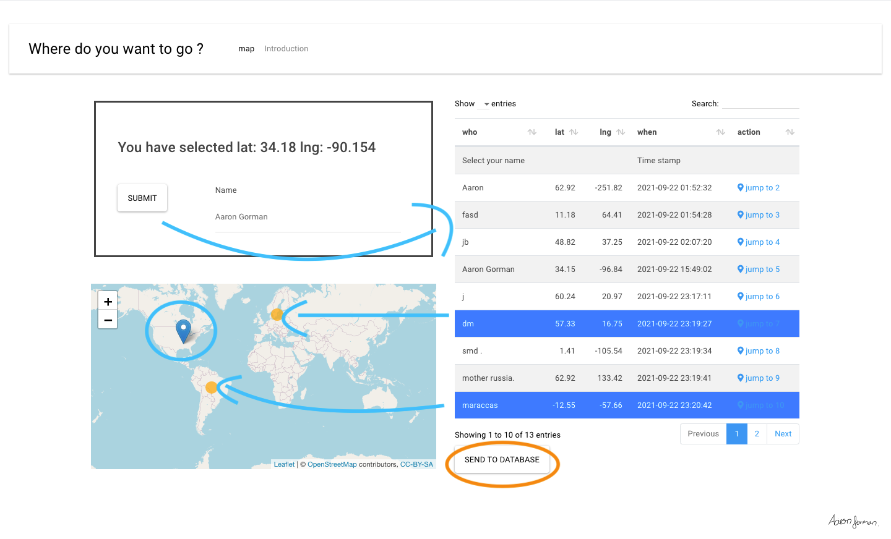
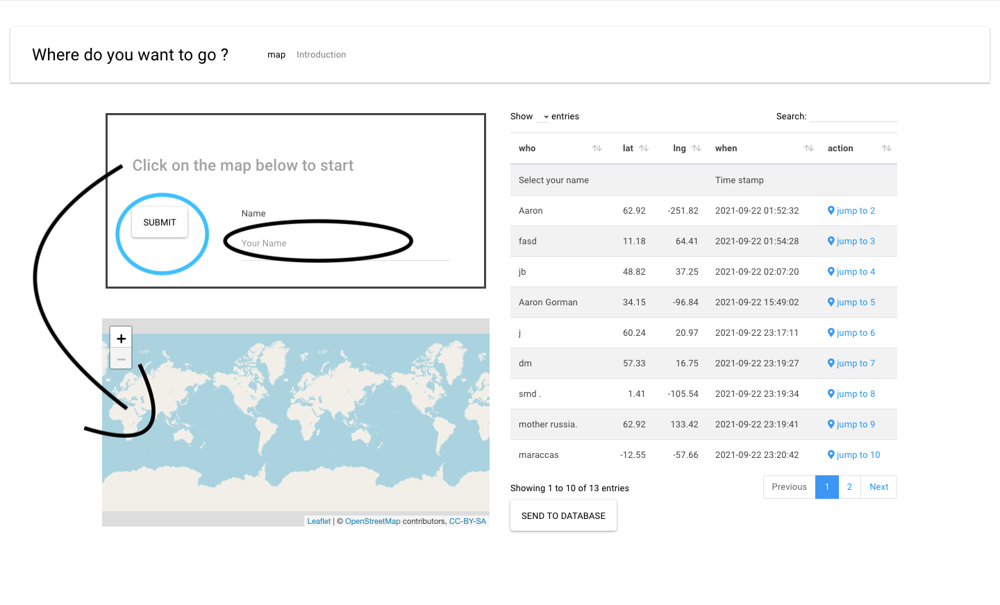

# Peristent storage with Rshiny on AWS managed Database
🍎
A demo **Rshiny** app demonstrating a _backend_  **MySQL** database hosted on **AWS**

- It means also because aws storage solutions dont have an R native sdk, so we can just use mysql drivers.
- It gets around the issues of _statelessness_ of RShiny apps, where info doesnt persist between sessions.
🧏

A demo deployment is hosted on shinyapps.io

## Below is an except of the tutorial 

### Start - form entry
Explore previous sessions data
or enter your own

### Push to database
Push to database once happy to save.

AG
<!--
